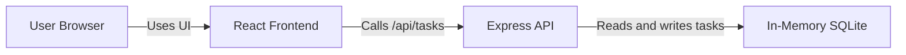

# Cloud Architecture Overview

This monorepo is a simple full-stack TODO application with a React frontend and an Express API backend. The frontend handles user interaction in the browser, the backend exposes task endpoints, and task data is stored in an in-memory SQLite database that exists only for the current application runtime.

## System Context

## Notes

- The frontend and backend are developed in the same monorepo.
- The backend uses an in-memory data store, so data does not persist across server restarts.
- The current architecture is intentionally simple and suitable for local development and bootcamp exercises.